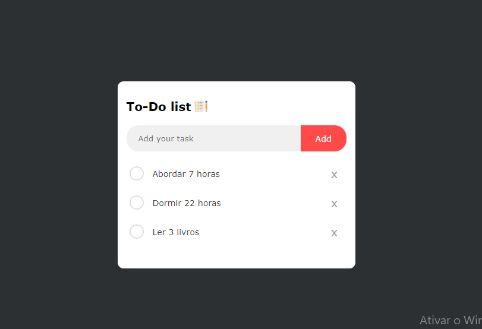

[JAVASCRIPT__BADGE]: https://img.shields.io/badge/javascript-%23323330.svg?style=for-the-badge&logo=javascript&logoColor=%23F7DF1E
[HTML__BADGE]: https://img.shields.io/badge/html5-%23E34F26.svg?style=for-the-badge&logo=html5&logoColor=white
[CSS__BADGE]: https://img.shields.io/badge/css3-%231572B6.svg?style=for-the-badge&logo=css3&logoColor=white
[PROJECT__BADGE]: https://img.shields.io/badge/📱Visite_esse_projeto-000?style=for-the-badge&logo=project
[PROJECT__URL]: https://todo-do-list-gc.netlify.app
[CHROME__URL]: https://www.google.com/chrome/dr/download/?brand=YTUH&ds_kid=43700077650614090&gad_source=1&gclid=Cj0KCQjwurS3BhCGARIsADdUH5167jbbhYJtsY6F3AVT8rrObpLIpiVZWD8Zy84x6tT5wKDHwt2-lRYaAo-7EALw_wcB&gclsrc=aw.ds 
[FIREFOX__URL]: https://mozilla-firefox.softonic.com.br
[OPERA__URL]: https://www.opera.com/pt-br/download

<h1 align="center" style="font-weight: bold;">Projeto To-Do List 💻</h1>


![javascript][JAVASCRIPT__BADGE]
![HTML5][HTML__BADGE]
![CSS3][CSS__BADGE]

<p align="center">
 <a href="#Sobre">Sobre</a> • 
 <a href="#started">Instruções de Uso</a> • 
</p>


<p align="center">
    
</p>

<h2 id="started">📌 Sobre</h2>

O projeto **To-Do List** é uma aplicação web simples, onde os usuários podem gerenciar suas tarefas diárias de maneira intuitiva. A aplicação permite adicionar novas tarefas, marcar como concluídas e removê-las. Desenvolvida utilizando HTML, CSS e JavaScript, a lógica principal se baseia na manipulação do DOM e na interação direta do usuário com os elementos da página.

Cada tarefa adicionada é exibida dinamicamente na tela, com funcionalidades como marcação visual de conclusão por meio de ícones e a opção de exclusão. O design minimalista visa proporcionar uma experiência limpa e direta para o usuário.

**Funcionalidades:**
- Adicionar tarefas à lista
- Marcar tarefas como concluídas
- Excluir tarefas

**Próximos passos:**
O projeto ainda será expandido com a integração de um banco de dados por meio de uma API para garantir a persistência das tarefas, permitindo que o usuário mantenha suas listas mesmo ao fechar o navegador.

**Tecnologias utilizadas:**
- HTML
- CSS
- JavaScript (manipulação do DOM)

[![project][PROJECT__BADGE]][PROJECT__URL]

<h2 id="started">🚀 Instruções de Uso</h2>

Aqui você discobrirá como rodar esse projeto localmente

<h3>Pré-requisitos</h3>

Aqui estão listados todos os pré-requisitos necessários para rodar meu projeto. Por exemplo:

- Um browser de sua prefêrencia ( Ex: [Chrome][CHROME__URL], [FireFox][FIREFOX__URL], [Opera][OPERA__URL]...)
- [Git](https://github.com)

<h3>Clonando para sua máquina</h3>

Como clonar esse projeto:

```bash
git clone https://github.com/CristaldoGui/to-do-list.git
```

<h3>Rodando</h3>

Como rodar esse projeto?

1 - Clique com o botão direito no arquivo "Index.html" <br>
2 - Selecione a opção "Abrir com..." ou "Open with..." <br>
3 - Escolha o browser de sua preferência ( Ex: [Chrome][CHROME__URL], [FireFox][FIREFOX__URL], [Opera][OPERA__URL]...)
